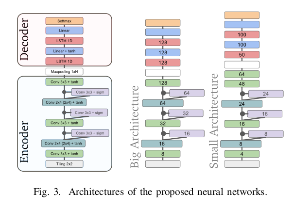

# Gated Convolutional Recurrent Neural Networks for Multilingual Handwriting Recognition


## Overview

This repository contains a PyTorch implementation of Gated Convolutional Recurrent Neural Networks (GatedCRNN) designed for multilingual handwriting recognition. The project provides a comprehensive framework for recognizing handwritten text across various languages using advanced neural network architectures.



## Features

- **Multilingual Support**: Capable of recognizing handwritten text in multiple languages.
- **State-of-the-Art Performance**: Utilizes cutting-edge GatedCRNN techniques to enhance accuracy and efficiency.
- **PyTorch Implementation**: Built with PyTorch, facilitating easy integration and extension.

## Installation

```bash
pip install -r requirements.txt
```

## Training

- **Dataset Preparation**

   Before training the model, you need to create the LMDB dataset. Run the following script to generate the dataset:

   ```bash
   python create_lmdb_dataset.py
   ```

- **Training the model involves two main steps**
   
   Initial Training: Run the following script to start the initial training process:
      
   ```bash
   python train.py
   ```
   
   Fine-Tuning: After the initial training, you can fine-tune the model using:
   
   ```bash
   python fine-tuning.py
   ```

## Demo

```bash
python demo.py
```

